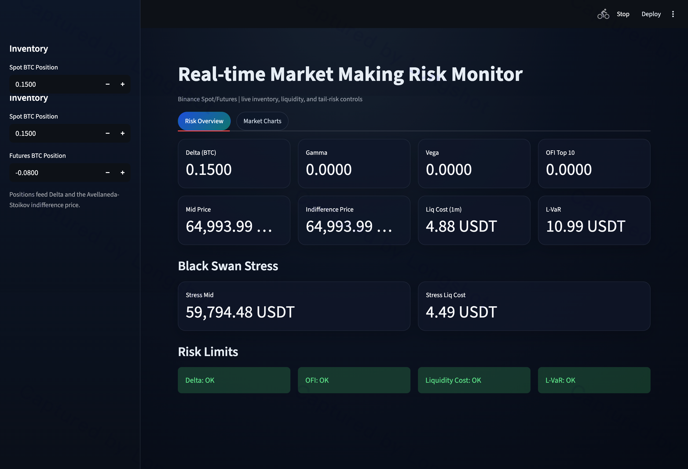
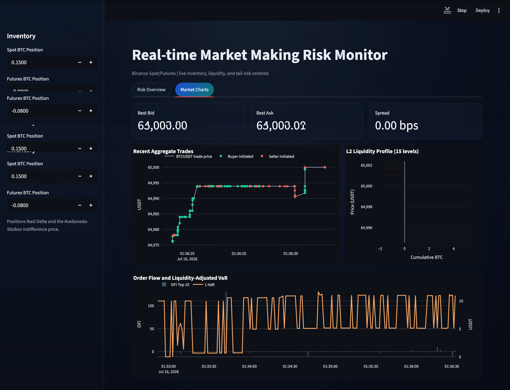

# Real-time Market Making Risk Monitor

A production-oriented risk monitor for Binance Spot/Futures market making, with live WebSocket market data, low-latency analytics, stress testing, and a Streamlit dashboard focused on inventory, flow, and liquidity risk.

## Overview

The system is designed to answer three questions in real time:

- How much inventory risk are we carrying?
- Is order flow turning against us?
- What would it cost to exit under current liquidity conditions?

## Screenshots

### Risk Overview



### Market Charts



## Architecture

- **Data Layer** (`connector.py`)
  - Async Binance connector using `ccxt.pro`-style WebSocket semantics.
  - Streams:
    - Level 2 order book for BTCUSDT Spot/Futures.
    - Aggregate trades for BTCUSDT Spot/Futures.
- **Analytics Layer** (`metrics.py`)
  - OFI from the top 10 order-book levels.
  - Inventory delta tracking and Avellaneda-Stoikov indifference price.
  - 1-minute liquidation cost from current depth.
- **Risk Layer** (`stress_test.py`)
  - Liquidity-adjusted VaR (L-VaR).
  - Black swan scenario: gap down plus bid-side liquidity vanishing.
- **Engine** (`engine.py`)
  - Async event queue and periodic risk loop.
  - Thread-safe shared buffer for UI and other consumers.
- **Interface** (`app.py`)
  - Dark-mode Streamlit dashboard with overview and market chart tabs.

## Project Structure

```text
.
├── app.py
├── market_charts.png
├── pyproject.toml
├── README.md
├── requirements.txt
├── risk_overview.png
└── src
    └── risk_monitor
        ├── __init__.py
        ├── buffer.py
        ├── config.py
        ├── connector.py
        ├── engine.py
        ├── main.py
        ├── metrics.py
        ├── models.py
        └── stress_test.py
```

## Runbook

```bash
python -m venv .venv
source .venv/bin/activate
pip install -e .
streamlit run app.py
```

Headless engine mode:

```bash
python -m risk_monitor.main
```

## Risk Control Baseline

- **Hard limits**
  - `max_abs_delta_btc`
  - `max_lvar_usdt`
  - `max_liquidation_cost_usdt`
  - `max_abs_ofi`
- **Limit policy**
  - Breach -> alert and UI red status.
  - Persistent breach -> throttle quoting or reduce inventory.
  - Severe breach -> kill-switch for the strategy gateway.

## Operational Robustness

- **Data reliability**
  - WebSocket reconnect with bounded retry.
  - Sequence checks and stale-data detection.
- **Concurrency safety**
  - Shared state protected by a lock in `SharedBuffer`.
  - Async producer/consumer decoupled by a bounded queue.
- **Failure containment**
  - Risk loop isolated from feed tasks.
  - Backpressure handling for queue overflow.
- **Observability**
  - Track loop latency, queue depth, and stale feed counters.
  - Export metrics to Prometheus or StatsD.
- **Disaster controls**
  - Graceful shutdown hooks.
  - Playbook for exchange outage, stale book, and partial fills.

## Production Hardening

- Add authenticated user data streams for exact position sync.
- Persist tick and risk snapshots for replay and post-trade forensics.
- Add unit tests for OFI, liquidation model, L-VaR, and stress scenarios.
- Integrate order gateway controls for automated risk actions.
